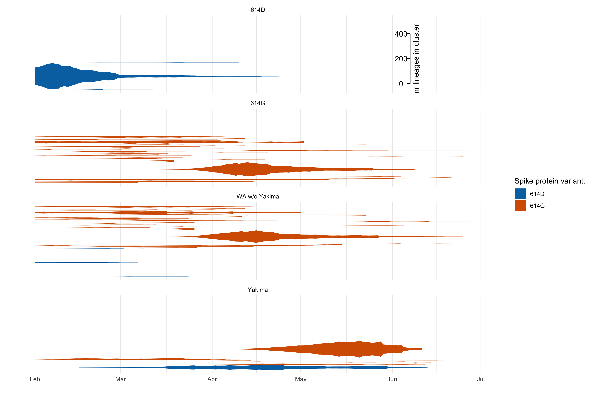
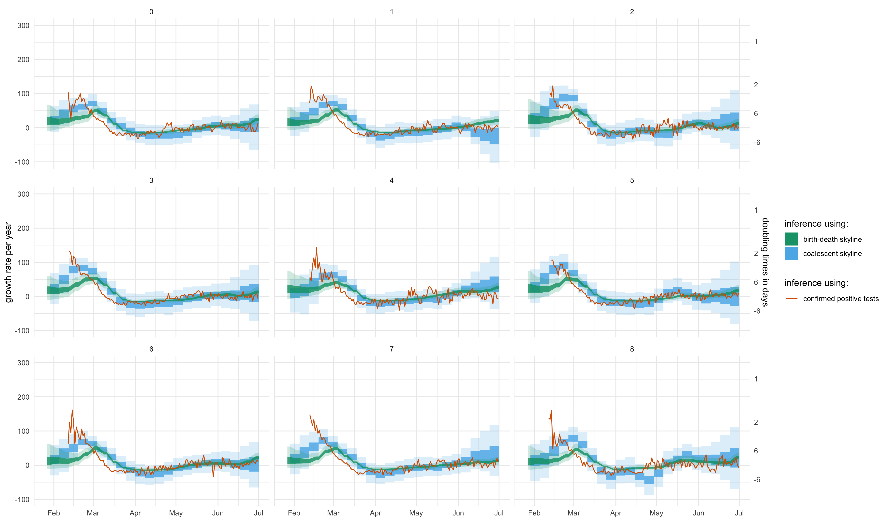

# Outbreak in Washington State driven by repeated introductions and rapid early growth

1Vaccine and Infectious Disease Division, Fred Hutchinson Cancer Research Center, Seattle, WA, USA

## Methods and Materials

### Introductions into Washington State

In order to distinguish between sequences that are connected by local transmission, we cluster all sequences from Washington State together based on their pairwise genetic distance.
To do so, we first built a phylogenetic tree based solely on the pairwise genetic distances using the sequences from Washington State using the nextstrain pipeline.
We then consider samples as connected if their pairwise genetic distance is less than 5 mutations apart.
Next, we group all sequences together that are connected via the above threshold.

### Estimating population dynamics jointly from multiple local outbreak clusters

In order to estimate the population dynamics of the Washington State outbreak, we use a coalescent approach to infer these dynamics jointly from all known local outbreak clusters.
To do so, we model the coalescence and migration of lineages within Washington State as structured coalescent process with known migration history.
The known migration history here is given by the clustering of sequences into local outbreak clusters.
The migration events from anywhere outside WA into WA are always assumed to have happened before the common ancestor of all sequences in each local outbreak cluster.
How long before this common ancestor time is inferred during the MCMC.

We then infer the effective population size and rates of introductions through time using a skyline type approach.
Effective population sizes and rates of introduction are allowed to change at predefined time points.
Between these predefined time points where the rates are estimated, the rates are interpolated.
This is equivalent to assuming exponential growth or decline between the effective population sizes at theses time points.

We then use two different ways to account for correlations between adjacent effective population sizes (Ne).
First, we use the classic skyride approach where we assume that the logarithm of adjacent Ne is normally distributed with mean 0 and an estimated sigma.
Second, we use an approach where we assume that the differences the growth rates are normally distributed with mean 0 and an estimated sigma.
This is equivalent to using an exponential coalescent model with time varying growth rates.

In contrast to backwards in time coalescent approaches, we can consider different local outbreak clusters as independent observations of the same underlying population process using birth death models.
We infer the effective reproduction number using the birth-death skyline model by assuming the different local outbreak clusters are independent observations of the same process with the same parameters.
As for the coalescent approach, we assume adjacent effective reproduction numbers to be normally distributed in log space with mean 0 and an estimated sigma.
We further assume the becoming un-infectious rate to be 36.5 per year which corresponds to an average time of infectivity of 10 days.
Further, we assume that the probability of an individual to be sampled and sequenced upon recovery to be the same throughout the sampled period.

### Sampling of epidemiologically unlinked cases

Phylodynamic approaches typically assume that all the available sequences are representative of the underlying population.
In other words, this means that they assume that all samples were taken at random.
We have sequences from different laboratories using different testing criteria in Washington State.
First, we have sequences from test performed by UW Virology, which are sequences typically isolated from sick patients.
We assume that the samples from UW Virology were indeed sampled at random and therefore include all of those in the analysis.
Additionally, we have sequences from the Washington Department of Health (WADoH) and the Seattle Flu Study.
A large amount of samples from WADoH are sampled at the same time and cluster together and therefore might not be unlinked.
Samples from the Seattle Flu Study are more evenly distributed across the tree.
We, however, see a lot of sequences sampled on the same day clustering together and can not directly assume they are unlinked as well.

In order to still include at least some of those cases while still having an at least somewhat unbiased way of including them, we performed two separate sub-sampling procedures.
We once add 50 and once 150 samples from the Seattle Flu Study and WADoH to the samples from UW Virology.
To do so, we randomly chose 50 (or 150) samples from this pool using the inverse number of samples from the same day as the probability of choosing a sample.
This does two fold.
First, it gives us a more event distribution of samples through time.
Second, it puts lower weights on days where we have a lot of samples.
These are also samples that are more prone to epidemiological linkage.
The different number of samples are to see if more samples, and therefore potentially more linked samples, change the results

## Results

### Outbreak in Washington State caused by repeated introductions

SARS-CoV-2 was introduced repeatedly into Washington State from different parts of the world.
The outbreak can be separated into two larger groups that make up the majority of cases and the majority of cases originated from at least two different introductions into Washington State.
The first one was likely introduced around the beginning of February either directly from China or via unknown intermediate locations.
The second one is derived from lineages from Europe and was most likely introduced between mid and the end of February.
As for the introduction from China, it is very much possible that these were not direct introduction an intermediate locations were involved.

To date, and as shown in the figure below, these two local outbreak cluster make up the vast majority of cases in Washington State.
Additionally, we see evidence for several additional introductions of lineages into Washington State that are derived from lineages that previously circulated in Europe, as well as from some, were the origin of the lineage is more uncertain.
These lineages were most likely introduced from areas were sampling and sequencing is sparse, which could include other areas of the United States.

<figure>
	
	
	<figcaption>Figure 1: Lineage through time plot of different local outbreak clusters that have more than one sampled sequence.
  The plot show the inferred lineages through time for different local outbreak clusters.
  The different lineage through time plots are colored by their likely source of introduction outside the USA.
  </figcaption>
</figure>

### Introductions caused but did not drive the outbreak

While introductions certainly caused the outbreak in Washington State, it is unclear how important they where to driving it.
To test this, we estimate the relative contribution of introduction compared to local transmission.
As described in the Methods and Materials part, the coalescent skyline estimate from multiple local outbreak clusters allows us to estimate the rate of introduction.
The rate of introduction $$i$$ can be described as $$\frac{I_{outside} m^{f}}{I_{WA}}$$.
This means that the number of introductions per unit of time can be expressed as $$i * I_{WA} = I_{outside} m^{f}$$
We then assume that we can approximate the local transmission rate $$\theta$$ by using the change in effective population sizes over time.
The number of novel infections per unit of time can then be described as %%\theta * I_{WA}$$.
We then compute the ratio of introductions over local transmissions as the ratio of the introduction rate over the transmission rate $$\frac{i * I_{WA}}{\theta * I_{WA}} = \frac{i}{\theta}$$.

The resulting estimates include a large amount of assumptions and should be interpreted as such, but can nevertheless give us an idea of how important introductions overall are.
As shown in the figure below, we estimate the percentage of new cases to be below 10 after the initial introductions and most likely to be around 1%.

<figure>
	
	
	<figcaption>Figure 2: Estimated percentage of new cases due to introductions.
  </figcaption>
</figure>

We next test how likely adding more samples is to reveal new introductions into Washington State.
The less likey this is, the less important introductions are to driving the outbreak.
We test this by randomly subsampling the overall dataset and counting the number of introductions after.
We repeat this for different amount of samples and then compute how probable one new sample is to reveal a new introduction.
We find that the sequencing most likely caught all larger outbreak as of March 24th.

<figure>
	
	
	<figcaption>Figure 3: Probability of catching new introductions with additional samples.
  </figcaption>
</figure>

### Rapid early growth of COVID-19 cases

Due to a lack of testing, it was for a long time unclear whether there was local transmission in the USA in general, as well as in Washington State.
After local transmission was shown on March the 5th, COVID-19 cases from Washington State were sequenced.
These genetic sequence data allow us to reconstruct transmission dynamics even before large scale testing for COVID-19 began.

To do so, we use two approaches, a birth-death skyline approach where we treat each separate introduction as independent observation of the same local population dynamics.
Additionally, we use a coalescent skyline approach, where we model the coalescence of lineages in WA and the introduction of lineages into WA as structure coalescent process with known migration histories.
The migration histories are given by the initial clustering of sequences into groups of local outbreak clusters.

When estimating the effective reproduction number through time, we see that the outbreak grew rapidly between mid and end of February. During this time, it was unknown that SARS-CoV-2 was spreading in the USA.
The Re then dropped to about 2.5 by the end of February, which is consistent with previously reported values for reproduction numbers in other places.

On the 13th of March, local spread of SARS-CoV-2 was first reported in the Washington State area and the number of confirmed new cases began to flatten soon after.
On the 23th of March, several businesses started to institute home office and on the XXth of March, a stay at home order was issued from the Governor.

<figure>
	
	
	<figcaption>Figure 4: Effective reproduction number of of SARS-CoV-2 in Washington State.
  The effective reproduction number (on the y-axis) is estimated for intervals of 2 weeks using two different approaches.
  The coalescent skyline and birth death skyline both estimate a very high reproduction rate between mid and end of February and a drastic slow down in March.
  The three different lines show when local transmission was first reported in WA, when initial lock downs began and when the stay at home order was issued.
  </figcaption>
</figure>

### Testing of cases accurately reflects trends in new cases.

While there is intensive testing for COVID-19 in Washington State since the beginning of March, sampling as a percentage of overall cases likely remained low.
We here want to test whether there are significant transmission dynamics that are not captured in the number of positive tests through time.
As we reconstruct the population dynamics from genetic sequence data, we use information from how individual cases are related genetically to reconstruct population dynamics.
Using the coalescent approach described above, this allows us to reconstruct the population dynamics of the spread of COVID-19 while conditioning on the sampling.
This means that we do not directly use the number of samples through time to inform these population dynamics.
This, in turn, allows us to test whether there are undetected transmission dynamics that are not captured by the number of positive samples through time.

When comparing the estimated effective population sizes to the number of positive tests shifted by 9 days, we find that the trends between them agree.
After testing was started late and the initial growth phased was missed, the number of new positive tests starts to follow the same trend as the estimated effective population sizes.

<figure>
	
	
	<figcaption>Figure 5: Comparison between effective population sizes and number of positive tests by UW Virology.
  </figcaption>
</figure>

We find that daily growth rate in new cases computed from the number of daily positive test to the growth rate estimates from the coalescent skyline approach agree well.
As mentioned above, the PCR testing captured the last part of the rapid initial rapid growth phase and agrees well after that with the phylodynamic estimates.

<figure>
	
	
	<figcaption>Figure 6: Comparison between growth rate estimates using the coalescent skyline and testing data.
  Here we compare the growth rates (on the y-axis) of the Washington State outbreak to the growth rates calculated from the number of positive tests from UW Virology.
  The growth rate estimates from UW Virology are shifted by 9 days to reflect the time delay between the time of infection and the occurrence of symptoms.
  </figcaption>
</figure>

### Effect of heterogeneous offspring distributions on parameter estimates

In order to be able to perform phylodynamic inferences, we used fairly simple models, we therefore next tested if we are able to infer changes in the population dynamics nonetheless.
To do so, we simulated phylogenetic trees from an EIR compartmental model, i.e. a SEIR model where we assume that the number of susceptibles is not limiting.
We assume that transmission is equally likely in the E and I compartment.
We further assume the probability of moving from the E to I and from the I to the R compartment is exponentially distributed with mean=5 days.
This leads to a mean time of infectivity if 10 days.

We used a simulation time of 6 weeks, with the Re changing from 5 to 2 and then to 1 in windows of 2 weeks.
During each window, we assume the number of infections each infection event causes to be distributed according to a negative binomial distribution with mean=1 and k=0.3.

We next simulated sequences of 29000 based pair length using and HKY + Gamma model with a transition/transversion ratio of 6.4, a gamma rate of 0.05 and an average rate of evolution of 0.008 per site and year.
We then infer the population dynamics from these sequences using the same two approaches with the same settings as described above.
We find that the most of the time, both approaches are reliably able to infer changes in the growth rates.
The coalescent skyline approach, however, can be subject to strong biases, while the birth-death approach seems to be largely unaffected.

<figure>
	
	
	<figcaption>Figure 4: Comparison between growth rate estimates using the birth-death and coalescent skyline and testing data from simulated data.
  </figcaption>
</figure>

## Supplementary Material

### Comparison of inferred rates when using different amounts of additional samples

As mentioned above, we considered all samples for UW Virology to be random samples from the population.
We also added samples from WADoH and from the Seattle Flu Study, once adding 50 and once 150 samples.

<figure>
	
	
	<figcaption>Figure S1: Comparison between growth rate estimates using the birth-death and coalescent skyline and testing data from simulated data.
  </figcaption>
</figure>
