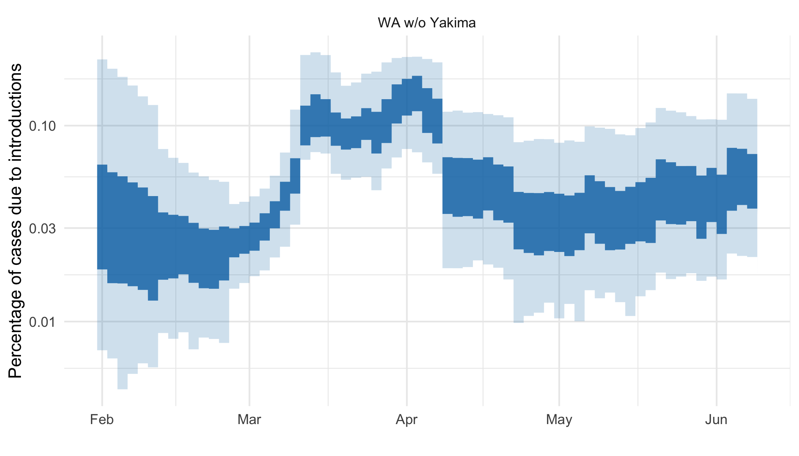
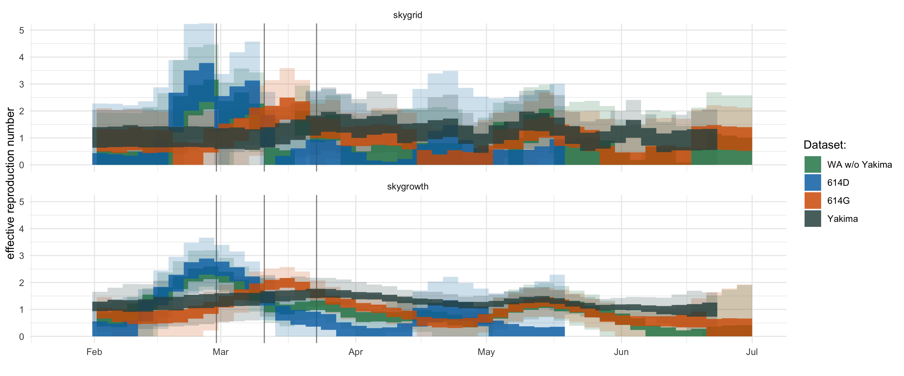
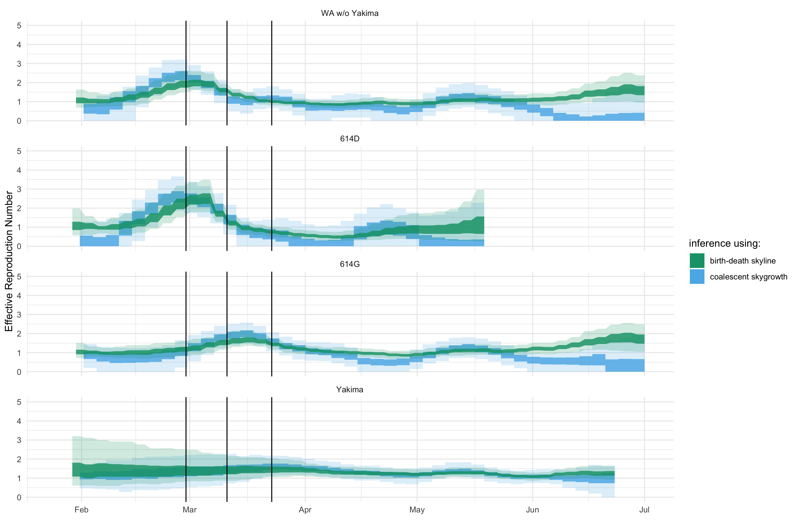
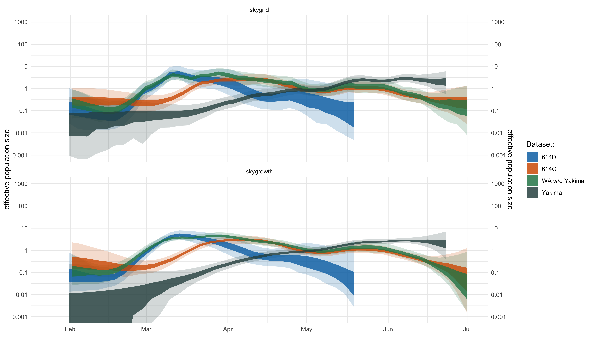

# Phylodynamic analysis of COVID-19 outbreak in Washington State shows rapid early growth followed by substantial reductions in transmission

Nicola F. Müller1, Cassia Wagner1, Timothy Vaughan2, Tanja Stadler2, Trevor Bedford1

1Fred Hutchinson Cancer Research Center, Vaccine and Infectious Disease Division, Seattle, WA, USA
2ETH Zürich, Department for Biosystems Science and Engeneering, Basel, CH
## Introduction

After it jumped from animals to humans likely sometime in the end of November or beginning of December in Wuhan, China, SARS-COV-2 spread around the world, dramatically impacting the lives of people.
An initial case of COVID-19, the disease caused by SARS-CoV-2, was reported in Washington State on January 19th by someone who came back from China 4 days earlier.
After that, there were no additional cases of COVID-19 reported in the greater Seattle area until the end of February, when the genetic sequence data of a virus isolated from a case was shown to be closely linked to the earlier case in January ([Bedford et al][Bedford et al]).
The patient from whom the virus was isolated did not have any travel history and represents the first known case of community transmission in the state.
The exact relation to the initial introduction remains unclear and more than one introduction of similar strains could account for the observed patterns as well ([Bedford et al][Bedford et al]).

After local spread of SARS-CoV-2 was communicated, PCR based testing was ramped up, showing a rapidly growing outbreak, mainly in the greater Seattle area.
While the number of positive tests over time can give us insight into how the epidemic behaved, there is likely a significant undercounting of the actual number of cases.

Instead of directly using the number of positive tests to infer the dynamics of SARS-CoV-2 spread in Washington State, we here use the genetic sequence data of viruses isolated from patients in Washington State using phylodynamic methods ([Grenfell et al][Grenfell et al]).
To do so, phylodynamic methods use the information of when viruses isolated from different patients last shared a common ancestor.
There are two conceptually different frameworks to do so, coalescent ([Kingman][Kingman]) and birth-death models ([Kendall][Kendall]).
In birth-death approaches, the birth, death and sampling of lineages over time are modelled.
Each lineage, which corresponds to a virus in a host, has a rate of birth (one lineage become two), death, or being sampled and appearing as a tip in the phylogeny.
In an epidemiological context, these rates correspond to transmission and becoming un-infectious rates.

Coalescent models on the other hand, try to describe something conceptually very different, that is how lineages coalesce from present to past.
Each lineage coalesces with any other co-existing lineage at a rate that is inversely proportional to the effective population size and proportional to the number of other co-existing lineages.
Coalescent approaches, in contrast to birth-death approaches, condition on sampling.
This means that they do not directly take into account how many samples there are available through time to inform population dynamics.

We here infer the past population dynamics of SARS-CoV-2 spread from local outbreak clusters of genetic sequence data from viruses isolated from patients in Washington State.
To do so, we here first split the outbreak in Washington State into sets of sequences that are likely connected by local transmission (to which we refer to as local outbreak clusters).
We then use these local outbreak cluster to infer the population dynamics of the Washington State outbreak jointly from all local outbreak clusters.

This allows us to first estimate the relative contribution of introductions compared to local transmissions, showing that while introduction causes the outbreak, the overall impact introductions have in driving the outbreak is low.
We then show that although testing PCR started late, it largely captured the dynamics of the outbreak.

## Methods and Materials

### Introductions into Washington State

In order to distinguish between sequences that are connected by local transmission, we cluster all sequences from Washington State together based on their pairwise genetic distance.
To do so, we first built a phylogenetic tree based solely on the pairwise genetic distances using the sequences from Washington State using the [Nextstrain pipeline](https://nextstrain.org/ncov).

We then compute the pairwise genetic distance between any two samples from Washington State.
If two samples have a genetic distance of less than 5 mutations, we consider them connected.
Next, we group all sequences together that are connected via the above threshold and consider each of these groups to be a separate local outbreak cluster.

### Estimating population dynamics jointly from multiple local outbreak clusters

To estimate the population dynamics of the Washington State outbreak, we use a coalescent approach to infer these dynamics jointly from all known local outbreak clusters.
To do so, we model the coalescence and migration of lineages within Washington State as structured coalescent process with known migration history.
The known migration history here is given by the clustering of sequences into local outbreak clusters.
The migration events from anywhere outside WA into WA are always assumed to have happened before the common ancestor of all sequences in each local outbreak cluster.
How long before this common ancestor time is inferred during the MCMC.

We then infer the effective population size and rates of introductions through time using a skyline type approach.
Effective population sizes and rates of introduction are allowed to change at predefined time points.
Between these predefined time points where the rates are estimated, the rates are interpolated.
This is equivalent to assuming exponential growth or decline between the effective population sizes at theses time points.

We then use two different ways to account for correlations between adjacent effective population sizes (Ne).
First, we use the classic skyride ([Gill et al][Gill et al]) approach where we assume that the logarithm of adjacent Ne is normally distributed with mean 0 and an estimated sigma.
Additionally, we use an approach where we assume that the differences the growth rates are normally distributed with mean 0 and an estimated sigma.
This is equivalent to using an exponential coalescent model with time varying growth rates.
We implemented this approach as extension to the Bayesian phylogenetics software BEAST2 ([Bouckaert et al][Bouckaert et al]).
The code for the multi tree coalescent is available here (https://github.com/nicfel/NAB).
We allow the effective population sizes to change every 2 days and the rates of introduction to change every 14 days.
The inference of the effective population sizes and rates of introductions is performed using a adaptive multivariate Gaussian operator ([Baele et al][Baele et al]), implemented here https://github.com/BEAST2-Dev/BEASTLabs.

In contrast to backwards in time coalescent approaches, we can consider different local outbreak clusters as independent observations of the same underlying population process using birth death models.
We infer the effective reproduction number using the birth-death skyline model ([Stadler et al][Stadler et al]) by assuming the different local outbreak clusters are independent observations of the same process with the same parameters ([Müller et al][Müller et al]).
We allow the effective reproduction number to change every 2 days.
As for the coalescent approach, we assume adjacent effective reproduction numbers to be normally distributed in log space with mean 0 and an estimated sigma.
We further assume the becoming un-infectious rate to be 36.5 per year which corresponds to an average time of infectivity of 10 days ([Ferretti et al][Ferretti et al]).
We allow that the probability of an individual to be sampled and sequenced upon recovery to change every 14 days.

### Subsampling of sequences

We analysed the population dynamics in total for 3 different datasets.
In the first datasets, we randomly subsample 1000 of the sequences from Washington State.
The sequences were selected at random using the inverse of the total number of samples per day as the weight.
For the second and third dataset, we distinguish between two different clades we call D and G.
The D clade consists of all sequences with a aspartic acid at site 614 of the spike protein.
The G clade consists of all sequences with a glycine at this positions (see here https://nextstrain.org/ncov/global?c=gt-S_614).
For these two datasets, we use the same subsampling procedure as for the above dataset, but with 500 sequences from each clade.

## Results

### Outbreak in Washington State caused by repeated introductions

SARS-CoV-2 was introduced repeatedly into Washington State from different parts of the world.
The outbreak can be separated into two larger groups that make up the majority of cases and the majority of cases originated from at least two different introductions into Washington State.
Among other genetic differences between these larger outbreak clusters, the substitution of aspartate (D) at position 614 of the spike protein to a glycine (G) has been of particular interest.
This is due to a previously suggested association with higher transmission and more severe clinical outcome ([Korber et al][Korber et al]).

The two larger local outbreak cluster were introduced at different times.
The first one was likely introduced around the beginning of February either directly from China or via unknown intermediate locations ([Bedford et al][Bedford et al]) and is part of the D clade.

The second one is derived from lineages from Europe and was most likely introduced between mid and the end of February and is part of the G clade.
As for the introduction from China, it is very much possible that these were not direct introduction an intermediate locations were involved.
Viruses closely related to the ones of this second local outbreak cluster, for example, are responsible for a large percentage of cases in the New York area.

To date, and as shown in the figure below, these two local outbreak cluster make up the vast majority of cases in Washington State.
Additionally, we see evidence for several additional introductions of lineages into Washington State that are derived from lineages that previously circulated in Europe, as well as from some, were the origin of the lineage is more uncertain.

After having comprised most of the cases initially, the D clade almost went extinct in Washington State.
In turn, The proportion of cases from the G clade steadily increased over time.

<figure>
	
	
	<figcaption>Figure 1: Lineage through time plot of different local outbreak clusters that have more than one sampled sequence.
  The plot show the inferred lineages through time for different local outbreak clusters.
  The different lineage through time plots are colored by the amino acid on position 614 on the spike protein.
  </figcaption>
</figure>

### Rapid early growth of COVID-19 cases

Due to a lack of testing, it was for a long time unclear whether there was local transmission in the USA in general, as well as in Washington State.
After local transmission was shown on February 29th, testing and genetic sequencing of viruses was started.
The genetic sequence data allow us to reconstruct transmission dynamics even before large scale testing for COVID-19 began.

To do so, we use two approaches, a birth-death skyline approach where we treat each separate introduction as independent observation of the same local population dynamics ([Müller et al][Müller et al]).
Additionally, we use a coalescent skyline approach, where we model the coalescence of lineages in Washington State and the introduction of lineages into the state as structured coalescent process with known migration histories.
The migration histories are given by the initial clustering of sequences into groups of local outbreak clusters.

We estimated the trend in $$R_{e}$$ using sequences from both clades, or the D respectively the G clade individually.
Using all sequences, we estimate that the outbreak grew rapidly with and $$R_{e}$$ of around 3 between mid and end of February.
This estimate of $$R_{e}$$ is consistent with estimates of effective reproduction numbers from other places before non-pharmaceutical interventions were taken.
We observe the maximal values for $$R_{e}$$ during a time when it was unknown that SARS-CoV-2 was spreading in the USA.
After community spread in Washington State was first reported on the 29th of February, the effective reproduction number started to drop.

The initial decline in $$R_{e}$$, was mostly driven by a decline in $$R_{e}$$ of the D clade.
The G clade, on the other hand, seems to have a high $$R_{e}$$ of around 3 for slightly longer, with a decrease in $$R_{e}$$ starting in early March.
Notably, however, we do not see a difference in the maximal $$R_{e}$$ and only observe a difference in when the decline in $$R_{e}$$ occurred.
This difference in decline could be explained by the different clades circulating in different geographic and or social groups in Washington State.
Spread of SARS-CoV-2 was initially reported to be mainly in Snohomish County, north of Seattle.
This might have affected behavior more strongly in these areas than in places where the G clade was circulating.
This means that the changes in relative frequencies of D and G clade can likely be explained by a difference in when the $$R_{e}$$ started to decline, rather than in a difference in the maximal observed $$R_{e}$$.

After measures by the state government were first taken on the 11th of March, the $$R_{e}$$ was close to 1 when using sequences from both clade and when using only sequences from the D clade.
When using only sequences from the G clade, the estimate of $$R_{e}$$ only dropped to around 1 close to when the "Stay Home Stay Healthy" lockdown was implemented.
Using any set of sequences, we estimate the $$R_{e}$$ to be around or below 1 after the "Stay Home Stay Healthy".

The inferred trends in effective reproduction numbers are consistent with a decrease in daily mobility of people that started at the beginning of March (https://covid.idmod.org/data/Physical_distancing_working_and_still_needed_to_prevent_COVID-19_resurgence.pdf).

<figure>
	
	
	<figcaption>Figure 2: Effective reproduction number of of SARS-CoV-2 in Washington State.
  The effective reproduction number (on the y-axis) is estimated for intervals of 2 days using a birth-death skyline model.
  The three different lines show when local transmission was first reported in WA, when initial state wide measures began and when the stay at home order was issued.
  </figcaption>
</figure>

### Testing of cases accurately reflects trends in new cases.

While there is intensive testing for COVID-19 in Washington State since the beginning of March, sampling as a percentage of overall cases likely remained low.
Using the coalescent, we can estimate past population dynamics while conditioning on sampling, which means that we do not directly consider the number of samples through time as informative about the population dynamics.

Using a coalescent skyline approach, we test whether there are significant transmission dynamics that are not captured in the number of positive tests through time.
As shown in the figure below, the effective population size estimates largely follow the number of cases through time when we assume an average time difference of 5 days between infection and onset of symptoms (blue interval).
This suggests that reported case counts are an accurate assessment of underlying prevalence.

The effective population size trends for the D and G clade are, however, differ greatly.
The effective population size estimated from the D clade peaks almost 2 weeks before the G clade.
At that time, the effective population size of the D clade was already declining for a while.
This is largely consistent with the trends in $$R_{e}$$ from above, estimated using the birth-death skyline model.

<figure>
	
	
	<figcaption>Figure 3: Comparison between the inferred effective population sizes and number of positive samples by symptom onset.
  Here we compare the inferred effective population sizes (y-axis, right) to the number of positive samples by symptom onset (y-axis, left).
	The number of positive samples is shifted by 5 days to correct for the average time difference between the time of infection and onset of symptoms.
	We show the inferred effective population sizes inferred from sequences from the D and G clade and the two clades separately.
  </figcaption>
</figure>

We next test how well the number of cases through time describe the dynamics of SARS-CoV-2 in Washington State.
To do so, we first computed the growth rate of the outbreak from the differences in effective population sizes over time.
Additionally, we computed the growth rate from the estimated effective reproduction numbers in the birth-death model.
We then computed the growth rate from the change in the number of cases by symptom onset averaged over 7 days.

We find that the trends in growth rates are the same in all estimates.

<figure>
	
	
	<figcaption>Figure 4: Comparison between growth rate estimates using the coalescent and birth-death skyline model and testing data.
  Here we compare the growth rates (on the y-axis) of the Washington State outbreak to the growth rates calculated from the number of positive tests by symptom onset.
	Additionally, we shift the growth rate estimates by 5 days to reflect the average difference in time between infection and symptom onset.
  </figcaption>
</figure>

### Introductions caused but did not sustain the outbreak

As mentioned above, the Washington State outbreak can be seen as many individual outbreaks of what we consider local outbreak clusters.
All these clusters were seeded by individual introductions into the State.
While introductions certainly caused the outbreak in Washington State, it is, however, unclear how important they where to sustaining it.

To test this, we estimate the relative contribution of introductions compared to local transmission.
As described in the Methods and Materials part, the coalescent skyline estimate from multiple local outbreak clusters allows us to estimate the rate of introduction.
The rate of introduction $$i$$ can be described as $$\frac{I_{outside} m^{f}}{I_{WA}}$$.
This means that the number of introductions per unit of time can be expressed as $$i * I_{WA} = I_{outside} m^{f}$$
We then assume that we can approximate the local transmission rate $$\theta$$ by using the change in effective population sizes over time.
The number of novel infections per unit of time can then be described as $$\theta * I_{WA}$$.
We then compute the ratio of introductions over local transmissions as the ratio of the introduction rate over the transmission rate $$\frac{i * I_{WA}}{\theta * I_{WA}} = \frac{i}{\theta}$$.

The resulting estimates include a large amount of assumptions and should be interpreted as such, but can nevertheless give us an idea of how important introductions overall are.
As shown in the figure below, we estimate the percentage of new cases to be below 10 after the initial introductions and most likely to be between 1% and 3%.

Towards April, the estimate increases to between 3% and 10%.
As a reference, the US instituted a travel ban for non-residents coming from China effective starting from the 2nd of February and from Europe starting on the 16th of March.
This increase of the inferred relative proportion in the number of infected on the overall number of cases is, however, unlikely driven by more introductions.
Rather, it can be solely explained by a decrease in the number of local transmissions which will automatically increase the percentage of introductions in the overall number of cases.

<figure>
	
	
	<figcaption>Figure 5: Estimated percentage of new cases due to introductions.
  </figcaption>
</figure>

We next test how likely adding more samples is to reveal new introductions into Washington State.
The less likely this is, the less important introductions are to driving the outbreak.
We test this by randomly subsampling the overall dataset and counting the number of introductions after.
We repeat this for different amount of samples and then compute how probable one new sample is to reveal a new introduction.
We find that the sequencing most likely caught all larger outbreak as of March 24th.

Additionally, we simulate what the same analysis would reveal when we perform simulations using different percentages of introductions from overall transmission events.
To do so, we simulate a sequence of cluster memberships, given that introductions are responsible for 10%, 1% or 0.1% of cases.
We do so by starting with one infected individual, we then randomly sample whether the next individual is from a new introduction or from a local transmission.
If it is from a local transmission, we randomly choose a previous infected individual and assign the same cluster membership to the newly infected individual.
As with the observed data, we then randomly choose different amount of samples and estimate the probability that adding one sample reveals a new introduction.
We find that the observed patterns are very similar to those expected for 1% of novel cases being due to introductions.

<figure>
	
	
	<figcaption>Figure 6: Probability of catching new introductions with additional samples.
  </figcaption>
</figure>

# Discussion

The outbreak of SARS-CoV-2 in Washington State was comprised of several local outbreak clusters, two of which caused the vast majority of cases.
These two local outbreak clusters are from two different clades that notably differ in one amino acid on position 614 of the spike protein.
This difference has been reported to cause differences in transmissibility and clinical outcome ([Korber et al][Korber et al]).
While we observe that the relative abundance of these clades changed over time, these changes can be explained by the reduction in $$R_{e}$$ to have occurred later in the G clade compared to the D clade.
While we can not exclude that this substitution in amino acid changes the transmissibility, we did not observe a strong difference in the maximal $$R_{e}$$ between the clades.
If we assume different distribution of cases of the D and G clade based on geography or social contact network, local measures (from officials as well as individual) to reduce the spread of SARS-CoV-2 could explain why the relative abundance of the clades changed over time.

Inferring the transmission dynamics over time, we find that the $$R_{e}$$ (at least in the D clade) reduced after local spread of SARS-CoV-2 was announced in the greater Seattle area and before interventions by the state government were enacted.
This suggests that actions taken by individuals and businesses to reduce the spread of SARS-CoV-2, such as mandatory work from home, helped to reduce transmission.
This does not apply to the G clade, however, where the $$R_{e}$$ seems to have only started to decline after initial measure by the state government were taken.
By the time of the state wide lockdown, the $$R_{e}$$ of the G clade was around 1 as well.

Comparing the trends in the number of cases to the estimates from the phylodynamic methods shows that although the number of cases is most likely greatly undercounted, the trends in the number of cases is likely reliable.

Lastly, we estimated the relative contribution of introductions of SARS-CoV-2 in driving the epidemic in Washington State.
While local outbreak was certainly sparked from outside, we find that the contribution of introductions to the overall case load in the state to be relatively low (<10%).
This suggest that measures to control the introduction of SARS-CoV-2 are likely less effective that measure to control local spread.
Particularly, considering that measures to control local spread also make it less likely for introductions to spark larger outbreaks.

## References

* [Bedford et al]: https://doi.org/10.1101/2020.04.02.20051417
* [Grenfell et al]: https://doi.org/10.1126/science.1090727
* [Kingman]: https://doi.org/10.2307/3213548
* [Kendall]: https://doi.org/10.1214/aoms/1177730285
* [Bouckaert et al]: https://doi.org/10.1371/journal.pcbi.1006650
* [Müller et al]: https://doi.org/10.1101/2020.04.27.052225
* [Baele et al]: https://doi.org/10.1093/bioinformatics/btx088
* [Ferretti et al]: https://doi.org/10.1126/science.abb6936
* [Korber et al]: https://doi.org/10.1101/2020.04.29.069054
* [Stadler et al]: https://doi.org/10.1073/pnas.1207965110
* [Gill et al]: https://doi.org/10.1093/molbev/mss265

## Supplementary Material

### R0 estimates using the coalescent and comparison to birth-death estimates

<figure>
	
	
	<figcaption>Figure S1: Estimates of R0 using the coalescent.
  </figcaption>
</figure>

<figure>
	
	
	<figcaption>Figure S2: Comparison between the effective reproduction number estimates for different datasets and using the coalescent or birth-death model.
  </figcaption>
</figure>

### estimates of effective population sizes for the different clades for the different clades using different priors

<figure>
	
	
	<figcaption>Figure S3: Comparison between the effective reproduction number estimates for different datasets and using the coalescent or birth-death model.
  </figcaption>
</figure>
